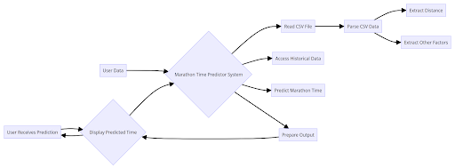
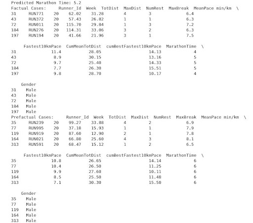
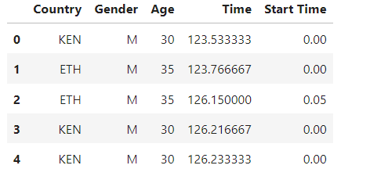
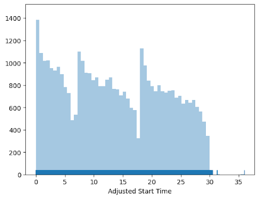
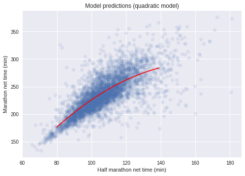

## Case-based Time Prediction for Recreational Marathon Runners

# Marathon Time Prediction Machine Learning  Model

# 4. Framework

4.1  Conceptual Design Diagram

As seen in Fig 4.1.1 & Fig 4.1.2, dfd for both levels  is presented respectively. 

Fig:- 4.1.1     Level 0 DFD Diagram

Elements of the diagram:

User Data: Data collected from the CSV file containing details about different marathon runners.
Marathon Time Predictor Model: Case based Machine Learning Model that predicts the time it will take for the runner to complete the marathon.
Prepare Output: The model will provide us the desired output that we can provide to the user.
Display Predicted Time: Display the output time with visualized model statistics.

Fig:- 4.1.2    Level 1 DFD Diagram

 # Elements of the diagram:

- User Data: Data collected from the CSV file containing details about different marathon runners.
- Marathon Time Predictor Model: Case based Machine Learning Model that predicts the time it will take for the runner to complete the marathon.
- Prepare Output: The model will provide us the desired output that we can provide to the user.
- Display Predicted Time: Display the output time with visualized model statistics.
- Read CSV file: Model will read the csv file from input.
- Parse CSV Data: The model with do some exploratory data analysis
- Extract Distance: Model will study the distance for specific runners based on their training plans.
- Access Historical Data: Based on the data of training, the model will study the previous mentioned data.
- User receives prediction: Output is received by the user.

# 4.2  Algorithm 

Implementing the below algorithm given in the research paper and showing results in Fig 4.2.1 & Fig 4.2.2.

Algorithm 1 is designed to generate time predictions of the recreational runners and perform pre training time estimation and training recommendation. It takes time depending on the query of the particular operator (q) and the casebase (CB). In addition, it takes into account parameters such as the current training week (w), the number of actual and preliminary data to be received, a factor that represents the difference between the runner's estimate and the expected completion time (𝛿). K is the total case. and significance level (p). Results include estimated marathon time (P), accuracy problem (𝛿), a set of preconditions (cp & cf), and accuracy and a differences in the cases (sig).
 
1: 𝐶 ← 𝑓 𝑖𝑙𝑡𝑒𝑟(𝐶𝐵,𝑤𝑒𝑒𝑘 = 𝑞.𝑤𝑒𝑒𝑘, 𝑠𝑒𝑥 = 𝑞.𝑠𝑒𝑥) \
2: 𝐶 ′ ← 𝑠𝑜𝑟𝑡(𝐶, 𝑠𝑖𝑚(𝑞, 𝑐)) \
3: 𝑃 ← 𝑚𝑒𝑎𝑛(𝐶 ′ .𝑀𝑇 .ℎ𝑒𝑎𝑑 (𝑘)) \ 
4: if 𝛿 ≤ 0 then \
5: 𝐶𝑓 ← 𝐶 ′ [𝐶 ′ .𝑀𝑇 ≥ 𝑃].ℎ𝑒𝑎𝑑 (𝑘) \
6: 𝐶𝑝 ← 𝐶 ′ [𝐶 ′ ≤ 𝑃 ∗ (1 + 𝛿)].ℎ𝑒𝑎𝑑 (𝑘) \
7: else \
8: 𝐶𝑓 ← 𝐶 ′ [𝐶 ′ .𝑀𝑇 ≤ 𝑃].ℎ𝑒𝑎𝑑 (𝑘) \
9: 𝐶𝑝 ← 𝐶 ′ [𝐶 ′ ≥ 𝑃 ∗ (1 + 𝛿)].ℎ𝑒𝑎𝑑 (𝑘) \
10: end if \
11: 𝑠𝑖𝑔 ← [] \
12: for 𝑓 in 𝐶 ′ .𝐹 ′ do \
13: 𝑠𝑖𝑔.𝑎𝑝𝑝𝑒𝑛𝑑 (𝑓 ) if 𝑡𝑡𝑒𝑠𝑡(𝐶𝑓 .𝑓 ,𝐶𝑝 .𝑓 ) < 𝑝 \
14: end for \
15: return 𝑃,𝐶𝑓 ,𝐶𝑝, 𝑠𝑖𝑔 \

# Implementing the above algorithm we get the following results.

Fig:- 4.2.1   UMAP Projection

Fig:- 4.2.2    Final results of Time Prediction

# Experimental Setup

5.1 Jupyter Notebook

	The Jupyter Notebook application is an application that allows data collection to be edited in server and processed through a web browser. Jupyter Notebook applications can be run on a local desktop that does not require network access (as described in this document), or can be installed remotely to manage and access the network. 

Notebooks include a "control panel" (Notebook Control Panel) in the Jupyter Notebook application that shows local documents and allows them to open or close the notebook.

# 5.2 Dataset Explanation

Table 5.2.1   Strava Dataset

The above table 5.2.1 shows Strava_Dataset that has been generated using publicly available data.

Model Used:
UMAP

**Evaluation Metric**:

Mean Squared Error

Output data:
plot_umap(data)
Features Used:
C (Case Base): Filtered cases from the dataset.
P : Predicted Marathon Time.
Cf : Factual Cases
Cp: Prefactual Case
sig : Difference between factual and prefactual cases

	**Table 5.2.2   Berlin Marathon Dataset**

The above table 5.2.2 shows the Berlin Marathon Dataset that has been fetched from available data of the Berlin Marathon.

Model Used:
Random Forest Classifier
Ridge Regression
Dummy Regression

Evaluation Metric:
Mean Squared Error
Mean Absolute Error

Features Used:
le_gender: Label Encoder
dummy: Dummy Regressor
reg: Ridge Regression
standardScalerX : StandardScaler()

	Table 5.2.3   All Races Dataset

The above table 5.2.3 shows the All Races Dataset that has been fetched from the results of available data of the Marathon Runners running in events in Porto, Portugal.

Model Used:
Linear Regression
Gradient Boosting Machine

Evaluation Metric:
Mean Absolute Error
Features Used:
XGBRegressor

# 5.4 Berlin Marathon Time Prediction

5.4.1. Introduction

Marathons are a global phenomenon that attracts participants of all backgrounds and skill levels. Predicting a marathon runner's finish time can provide great information for runners, coaches, and athletes. Our aim in this project is to develop a machine learning model that will predict the completion time of the marathon based on the runner's age, gender, country and start time.

5.4.2. Hypothesis

We hypothesized that certain characteristics such as age, gender, and country have a positive relationship with time to complete the marathon. Additionally, we expect the time it takes for a competitor to cross the starting line after starting the race to be a significant predictor of finish time. 

5.4.3. Tools Used
We use the scikit-learn library in Python to build machine learning models to predict marathon completion times. More specifically, we investigate ridge regression and random forest regression algorithms to improve our prediction model.

5.4.6. Implementation

We have already collected and preprocessed data from the official Berlin Marathon website, resulting in the 'Berlin_Marathon_2017_Results_Clean.txt' CSV file. This dataset contains detailed information on over 39,000 finishers, including age, gender, country, starting time, and finishing time.

In conclusion, our project demonstrates the effectiveness of machine learning in predicting marathon finishing times based on various features. By further refining our models and exploring additional datasets, we can continue to enhance their accuracy and applicability in the domain of marathon prediction and analysis.

# Distplot :

sns.distplot(Results['Start Time'], bins = 60, kde=False, rug=True)
As we can see in Fig 5.4.6.1, an interesting pattern arises when looking at a histogram of the start times. It looks like the runners take off in 3 separate blocks, with a gap of over 10 minutes between each block.

		Fig 5.4.6.1   Histogram with separate blocks
To avoid too many runners and avoid collisions at the start and throughout the race, runners are often divided into groups based on finishing times, with faster runners starting at the front. However, depending on the marathon, the number of sets, the length of the set and the number of people who can cross the starting line at the same time are different. In fact, I run the same marathon every year. This means this needs to be taken into careful consideration when using the marathon or year model.

Even within the same year, it could cause issues, especially for linear models. It is unlikely to affect decision trees (and therefore random forests).
That means everyone who started in the second block (20:00 to 45:00 after the gun) will have 13 minutes subtracted from their start time (20 - 7). And everyone who started in the third block (> 45:00), will have 27 minutes subtracted from their start time ((20 - 7) + (45 - 31)).

Looking at Fig 5.4.6.2 the histogram of adjusted start times, there are now no big gaps between the starting groups.

Adjusted distplot :

def adj_start(x):
    if x < 20:
        return x
    elif x < 45:
        return x - 13
    else:
        return x - 27
Results['Adjusted Start Time'] = Results['Start Time'].map(lambda x: adj_start(x))
sns.distplot(Results['Adjusted Start Time'], bins = 60, kde=False, rug=True)

		Fig 5.4.6.2:-    Adjusted Histogram with no gaps.
5.4.4. Results

**After training and evaluation, here are the performance metrics of our models:**

Dummy Regressor :
Mean Absolute Error (MAE): [36.574535934873225]
Mean Squared Error (MSE) : [2115.2026126518654]

Ridge Regression :
Mean Absolute Error (MAE): [23.11751209759032]
Mean Squared Error (MSE) : [959.0024602923387]

Random Forest Regressor :
Mean Absolute Error (MAE): [22.50262657475109]
Mean Squared Error (MSE) : [926.7772542415825]

In conclusion, the ridge and random forest worked almost more than 50 percent better, with the random forest regression working the best.

# 5.5 Time prediction based on Half Marathon

5.5.1. Introduction

The marathon is a popular event that attracts runners of all levels, from casual gamers to elite athletes. Predicting marathon finish times is important for runners, coaches, and the athletes themselves. In this report, we present the results of a marathon running time prediction model developed using linear regression and gradient boosting machine (GBM) algorithms.

5.5.2. Dataset

We collected data from multiple marathons, including information on runner characteristics such as age, gender, training distance, and previous race time. These data contain numerical and categorical features, and the target variable is the runner's completion time. The file used is allraces.csv.

5.5.3. Methodology

We use two different learning algorithms to build predictive models:

Linear Regression: This algorithm fits a linear relationship between the input features and the target variable. It's a simple yet effective method for regression tasks.
Gradient Boosting Machine (GBM): GBM is an ensemble learning technique that builds multiple decision trees sequentially, where each tree corrects the errors of the previous one. GBM often performs well on complex datasets and can capture non-linear relationships between features and the target variable.

5.5.4. Model Training and Evaluation

We split the dataset into training and testing sets (e.g., 80% training, 20% testing) to train and evaluate our models. For both Linear Regression and GBM models, we used common evaluation metrics such as Mean Squared Error (MSE) and Mean Absolute Error (MAE) to assess the models' performance on the testing set. Fig 5.5.4.1 and 5.5.4.2 show variations in Linear Regression Model. And Fig 5.5.4.3 shows Variation in GBM Model.

**Linear Regression model :**

Fig :- 5.5.4.1  Linear Model

Fig 5.5.4.2 :-   Linear Model with quadratic terms

**GBM Model :**

Fig 5.5.4.3 :-   GBM Model

**5.5.5. Results**

After training and evaluation, here are the performance metrics of our models:

Linear Regression:

Mean Absolute Error (MAE): [17.305158988773151]

Gradient Boosting Machine (GBM):

Mean Absolute Error (MAE): [16.946433495448755]

5.5.6. Discussion

Both models performed reasonably well in predicting marathon runners' finishing times.
The GBM model outperformed the Linear Regression model, indicating that it was better able to capture the complexities in the dataset.
Further optimization and feature engineering could potentially improve the models' performance.

5.5.7. Conclusion

In summary, we develop and evaluate two marathon time estimates using linear regression and GBM algorithms. While both models gave good results, the GBM model performed better. This model could become an important tool for runners, coaches, and athletes to predict marathon completion times and improve training strategies.

